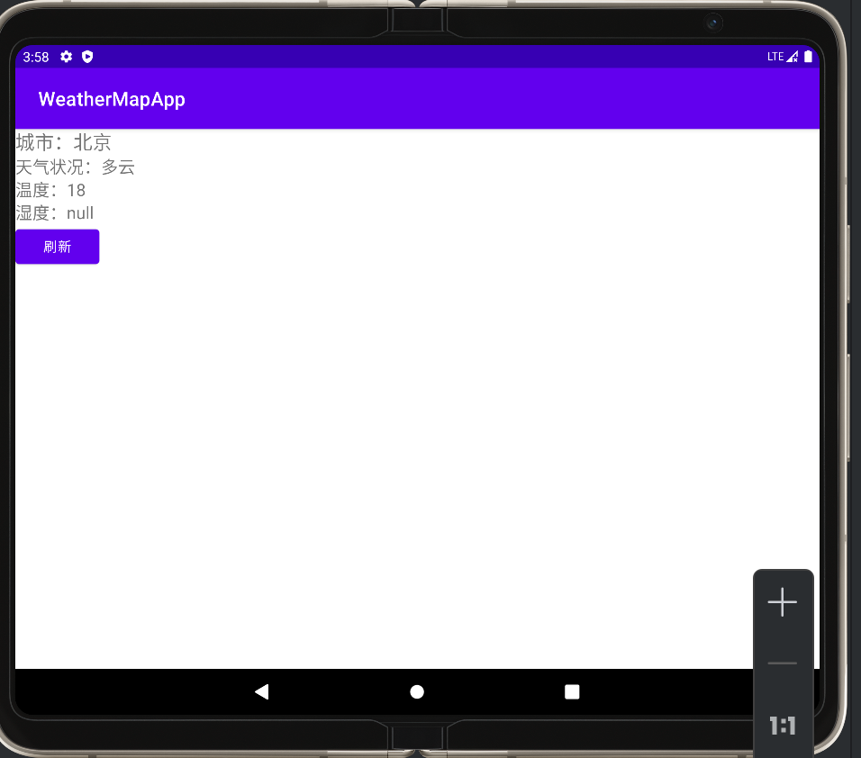

+++
date = '2024-11-17T13:00:48+08:00'
title = 'AIThought'
categories = ["闲暇思考"]
tags = ["AI"]
+++

# Why

在上周四下午，我的导师给了我一个小任务，开发一个简单地安卓App调用相关的天气，地图API以显示当前位置的温度，由于我的安卓开发水平并不是那么出色并且当晚就要交付，所以我使用AI来帮我完成这个任务。

我使用豆包在两个小时之内搭建好了这个简单的App，即使其中的代码逻辑原理我自己并不是那么的清楚。

